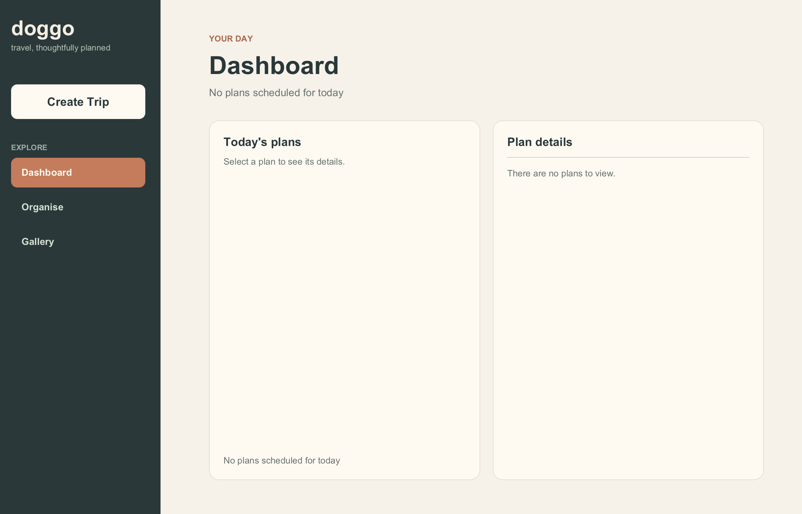

# doggo User Guide

doggo is a local-first desktop application for planning trips, organising
itineraries, and recording reviews. This guide describes the JavaFX desktop
application launched from `doggo.jar`.

## Getting Started

### 1. Install the required Java dependencies

doggo requires a Java Development Kit (JDK) 25 or newer. The project is
developed and tested with Java 25.0.3. Install a JDK rather than only a JRE so
that the `java` command is available in your terminal.

Download a JDK from one of these providers:

- [OpenJDK 25](https://jdk.java.net/25/)
- [Azul Zulu JDK downloads](https://www.azul.com/downloads/?package=jdk#zulu)

The released `doggo.jar` already contains the JavaFX 25.0.3 and SQLite JDBC
runtime dependencies, including native JavaFX classifiers for Windows, Intel
macOS, Apple Silicon macOS, and Linux. You do not need to install JavaFX or
SQLite separately to run the released JAR.

After installation, open a terminal and verify Java:

```text
java --version
```

The output should report version 25 (for example, `25.0.3`). If the command is
not found, restart the terminal after installing Java and check that the JDK's
`bin` directory is on your `PATH`.

#### Windows

1. Download the Windows x64 JDK installer from the provider above.
2. Run the installer and enable the option to add Java to `PATH` when it is
   offered.
3. Open PowerShell and run `java --version`.

#### macOS

1. Download the macOS installer matching your Mac's processor: Apple Silicon
   (AArch64) or Intel (x64).
2. Install the JDK package and open a new Terminal window.
3. Run `java --version`.

#### Linux

1. Download the Linux package matching your distribution and CPU architecture,
   or install OpenJDK 25 through your distribution's package manager when it
   is available.
2. Configure `JAVA_HOME` and `PATH` if the installer does not do so.
3. Run `java --version` in a new terminal.

### 2. Download the JAR

Download `doggo.jar` from the latest release of the
[doggo GitHub repository](https://github.com/blurfrost/CS3227-2610-MP1). On the
repository page, open **Releases**, choose the latest release, and download
`doggo.jar` from its **Assets** section. Save it somewhere you can write to,
such as your Downloads folder.

If a release is not available, contributors can build the JAR from the source
repository using `./gradlew clean shadowJar` on macOS/Linux or
`gradlew.bat clean shadowJar` on Windows. The generated file is
`build/libs/doggo.jar`.

### 3. Open the JAR

#### Using a file explorer

- **Windows:** Open File Explorer, go to the folder containing `doggo.jar`,
  and double-click it. If Windows asks which application to use, choose the
  Java platform application.
- **macOS:** Open Finder, go to the folder containing `doggo.jar`, and
  double-click it. If macOS displays a security prompt, use **Open** to allow
  the downloaded application to run.
- **Linux:** Open your file manager, go to the folder containing `doggo.jar`,
  and double-click it. If the file manager does not have a Java association,
  use the terminal command below.

#### Using a terminal

Running from a terminal is the most predictable way to choose the database
location. Change into the directory containing the JAR, then run it:

**Windows PowerShell**

```powershell
Set-Location "$HOME\Downloads"
java -jar .\doggo.jar
```

**macOS or Linux**

```bash
cd ~/Downloads
java -jar doggo.jar
```

Replace `Downloads` with the directory where you saved the JAR. The command
must be run from the directory containing the JAR only if you want the local
database to be created there.

### Local data location

doggo stores its SQLite database at `data/doggo.db`, relative to the process's
current working directory. The `data` directory is created automatically.
For example, the terminal commands above use:

```text
Downloads/
├── doggo.jar
└── data/
    └── doggo.db
```

Launching the JAR by double-clicking it delegates the working directory to the
operating system, so the database location may differ. Use the terminal method
when you need to control or inspect the location. Close doggo before copying or
backing up `doggo.db`.

## Overview of Interface

The main window has a persistent sidebar and a content area. The sidebar
contains **Create Trip** and the three navigation menus: **Dashboard**,
**Organise**, and **Gallery**. The selected menu is highlighted. The window can
be resized, but not below its minimum supported size.

### Dashboard menu

Dashboard is your view of today's itinerary. It displays every Plan scheduled
for the current date in chronological order. Select a Plan in the list to see
its destination, owning Trip, date, time, and review in the detail pane.

The detail pane provides **Edit**, **Add Review** or **Edit Review**, and
**Delete** actions for the selected Plan. If there are no Plans for today, the
list and detail pane show an explicit empty state.



### Organise menu

Organise displays current and upcoming Trips. Select a Trip to see its status,
inclusive date range, optional Trip review, and Plans in chronological order.
Use **+ Add plan** to add an itinerary stop to the selected Trip. Each Plan has
a **Details** action that opens its full details and management actions.

The Trip detail pane provides **Edit trip**, **Add Review** or **Edit Review**,
and **Delete trip** actions. Newly created current or upcoming Trips and Trips
edited to one of those statuses appear here.

### Gallery menu

Gallery displays completed Trips whose end date has passed. Select a Trip to
revisit its date range, Trip review, and recorded Plans. Gallery supports the
same Plan and Trip actions as Organise, including adding or editing Plans and
adding, editing, or removing reviews.

## Features

### 1. Creating a new Trip

1. Click **Create Trip** in the sidebar. This action is available from every
   menu.
2. Enter a Trip name.
3. Choose the **Starts** and **Ends** dates. Both dates are inclusive.
4. Click **Create trip**. Use **Cancel** to close the form without saving.

Trip names may contain up to 50 Unicode characters and cannot be blank. The
start date cannot be after the end date. A Trip ending before today is opened
in Gallery; a current or upcoming Trip is opened in Organise.

### 2. Creating a new Plan within a Trip

1. Open **Organise** or **Gallery**.
2. Select the Trip that should contain the Plan.
3. Click **+ Add plan** in the Trip details pane.
4. Enter a destination, choose a date, and enter a time in 24-hour `HH:mm`
   format, such as `09:00`.
5. Click **Add plan**.

The Plan date must fall within the Trip's inclusive date range. A new Plan's
date defaults to today when today is in the Trip; otherwise it defaults to the
Trip's start date. Destinations may contain up to 50 Unicode characters and
cannot be blank.

### 3. Viewing a Plan

- In **Dashboard**, select a Plan card from today's list. Its detail pane shows
  the destination, owning Trip, date, time, and review.
- In **Organise** or **Gallery**, select a Trip and click **Details** on a Plan
  card. The Plan details window shows the complete destination, Trip, schedule,
  and review, even when the compact list card truncates long text.

### 4. Editing a Plan

1. Open the Plan details pane in Dashboard, or click **Details** for the Plan
   in Organise/Gallery.
2. Click **Edit** or **Edit plan**.
3. Change the destination, date, or time.
4. Click **Save changes**.

The edited date must remain within the owning Trip's dates. Existing Plan
reviews are preserved. If a Dashboard Plan is edited so that it is no longer
scheduled for today, it leaves the Dashboard list after saving.

### 5. Reviewing a Plan

1. Select the Plan in Dashboard, or open its **Details** window from Organise
   or Gallery.
2. Click **Add Review**. For an existing review, click **Edit Review**.
3. Optionally select a rating from 1 to 5.
4. Optionally enter Notes.
5. Click **Save**.

A review must contain a rating, Notes, or both. To remove an existing review,
clear both the rating and Notes fields and save. Reviews remain attached when
the Plan itself is edited.

### 6. Deleting a Plan

1. Open the Plan details pane or Plan details window.
2. Click **Delete** or **Delete plan**.
3. Review the confirmation message and select **Yes** to delete, or **No** to
   keep the Plan.

Deleting a Plan also deletes its review. The application selects a nearby
remaining Plan when possible. Deletion cannot be undone unless you have a
backup of the database.

### 7. Editing a Trip

1. Open **Organise** or **Gallery** and select a Trip.
2. Click **Edit trip**.
3. Change the Trip name or its **Starts** and **Ends** dates.
4. Click **Save changes**.

The date range cannot be changed to exclude an existing Plan. If the edited
dates change the Trip's status, doggo routes it to the matching menu: past
Trips go to Gallery, while current and upcoming Trips go to Organise. An
existing Trip review is preserved.

### 8. Reviewing a Trip

1. Open **Organise** or **Gallery** and select a Trip.
2. Click **Add Review**. For an existing review, click **Edit Review**.
3. Select an optional rating from 1 to 5 and/or enter Notes.
4. Click **Save**.

Clear both fields and save to remove the Trip review. Trip reviews are shown
in the selected Trip's detail pane and remain preserved when the Trip is
edited.

### 9. Deleting a Trip (and all its Plans)

1. Open **Organise** or **Gallery** and select a Trip.
2. Click **Delete trip**.
3. Confirm with **Yes**, or choose **No** to cancel.

Deleting a Trip permanently removes the Trip, every Plan it contains, and all
Trip and Plan reviews belonging to that aggregate. The application selects a
nearby remaining Trip when possible.


## Frequently Asked Questions

### Which Java version do I need?

Install JDK 25 or newer. Verify it with `java --version`. A JRE-only install
or an older Java version may prevent the JAR from starting.

### Do I need to install JavaFX or SQLite separately?

No, not for the released JAR. JavaFX 25.0.3 and the SQLite JDBC driver are
bundled in `doggo.jar`. Only the JDK needs to be installed separately.

### The JAR does nothing when I double-click it. What should I do?

Open a terminal, change into the JAR's directory, and run `java -jar doggo.jar`.
The terminal displays a useful error if Java is missing, the JAR is damaged, or
the database cannot be opened. On macOS, approve the security prompt or use
Finder's **Open** command. On Windows, check the file's **Properties** for an
Unblock option if it was downloaded from the internet.

### Where is my database?

The database is `data/doggo.db` under the process's working directory. Starting
from `~/Downloads` uses `~/Downloads/data/doggo.db`; invoking a JAR in
Downloads while the terminal is in another directory uses that other
directory's `data/doggo.db`. Double-click launches may use an operating-system
specific working directory.

### Why is a Plan not visible on Dashboard?

Dashboard shows only Plans scheduled for today. Open the owning Trip in
Organise or Gallery to view all of its Plans.

### Why is my Trip not in Organise or Gallery?

Organise contains current and upcoming Trips. Gallery contains Trips whose end
date has passed. Trip status is calculated from the current date, so a Trip can
move between menus as time passes or after its dates are edited.

### Can I add a Plan directly from Dashboard?

No. Dashboard is a daily Plan view. Select the owning Trip in Organise or
Gallery and use **+ Add plan**.

### Can I delete a Trip without deleting its Plans?

No. A Trip owns its Plans, so deleting the Trip also deletes all of its Plans
and their reviews. Confirm the deletion only when the entire aggregate is no
longer needed.

### How do I back up or move my data?

Close doggo, then copy the complete `data` directory containing `doggo.db` to
a safe location. To continue using the same records, launch doggo from a
directory that contains that database path, or restore the directory to the
expected location before launching.

### Why is the Save button disabled?

The form contains invalid or incomplete input. Check the inline validation
message: Trip names and Plan destinations cannot be blank or longer than 50
Unicode characters, Plan dates must be within their Trip, and Plan times must
use valid `HH:mm` notation. A review must include a rating or Notes.

### Can I use the same JAR on Windows, macOS, and Linux?

Yes. The Shadow JAR packages the supported JavaFX native classifiers for those
platforms. Install a compatible JDK on each machine and launch the JAR with
`java -jar`.
